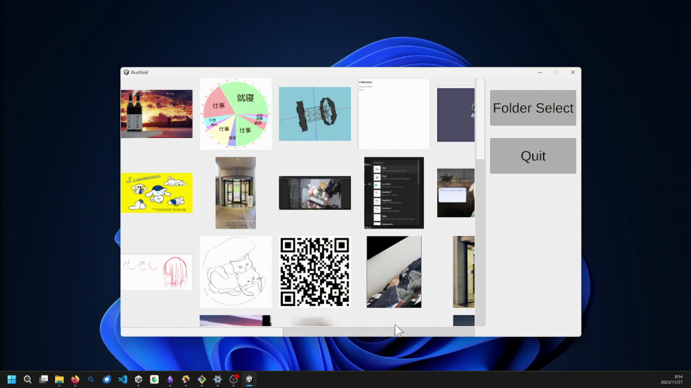

# IllustGrid_Unity
IllustGridとは、「P\*nterestっぽい画像ビューワーを自分のPCでできるようにしたい」というコンセプトで開発したデスクトップアプリです
任意のフォルダを選択すると、フォルダ内の画像ファイル(.pngだけ)をランダムに並べ替えて表示します。

「画像をランダムに並べ替えて一覧表示する」「自身のPCで実行できる」という2点で、単純な画像ビューワーやP\*nterestと差別化しました。

自分の集めたお気に入り画像を、新旧織り交ぜてみることで、「昔こんなの集めてたんだなー」と懐かしんだり、ものづくりのインスピレーションに使いたいなと思って開発しました。

以前Python版を開発していましたが、デスクトップアプリとして作りたかったのでUnityで作り直しました。

# 使い方
IllustGrid.zipをダウンロードして展開したら、フォルダ内のIllustGrid.exeを開けば利用できます。
IllustGridフォルダの中身をいじらなければ、フォルダ自体はどこに置いておいても大丈夫です。

アプリを開くとフォルダを選ばされるので、画像が入ったフォルダを選択すると、中の画像がランダムな順番で表示されます

同じフォルダでも、選択し直すと並び順が変わって表示されます。

# 解説
いるかわからないけど同じことをやりたい人向けに簡単な解説を残しておきます。スクリプトとつきあわせてご確認ください
本アプリは以下の4つの機能でできています

1. フォルダパスを取得
2. フォルダパスからファイルリスト生成
3. ファイルリストからパネルを生成
4. パネルに画像をアタッチ

### 1. フォルダパスを取得
FolderPathManagerが担当しています。

Unityプラグインの[StandaloneFileBrowser](https://github.com/gkngkc/UnityStandaloneFileBrowser)を使用して、フォルダ選択ダイアログを表示しています。このプラグインのフォルダ選択機能では、フォルダ選択時に大きさ1のstring[]を返します(おそらく複数選択機能のために配列にしている)。0番目の要素にフォルダパス(string)が入っているので、これを他のプログラムにわたすことで、「任意のフォルダ選択」機能を実装しています。

### 2. フォルダパスからファイルリスト生成
FileManagerが担当しています。

FolderPathManagerがフォルダパスを持っているので、それを参照して、フォルダ内にある全画像ファイルのパス(string)を取得します。

取得したファイルパスリストをシャッフルして返すことで、「ランダム順表示」を実装しています。

正規表現でフィルタリングが可能とのことだったので、"*png"としてpngファイルだけを抽出するようにしましたが、可能であればその他の画像ファイル(.jpg, .jpeg, .gif)も同時に抽出できるようにしたかったです

### 3. ファイルリストからパネル生成
ViewManagerが担当しています。

FileManagerが取得したファイルリストの数だけ画像をアタッチするためのUIを生成します。インスタンスを変数に代入すると、Instantiateしたあともデータを渡すことができるので、1つ1つのファイルパスを渡しています

### 4. パネルに画像をアタッチ
ImagePanelが担当しています。

ViewManagerから生成されたImagePanelは、それぞれが画像ファイルのパスを1つ持っているので、それをもとにテクスチャをロード、スプライトの形式にしてから自分にアタッチさせています。
